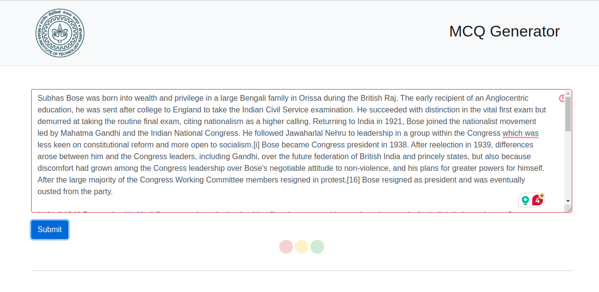

## Introduction

It is project developed under the guidance of Prof. Arnab Bhattacharya, IIT Kanpur.




## Installation

Download models

Allen NLP coref spanbert

```
wget https://storage.googleapis.com/allennlp-public-models/coref-spanbert-large-2021.03.10.tar.gz
```

Bert-WSD {first login to one drive}

```
https://entuedu-my.sharepoint.com/personal/boonpeng001_e_ntu_edu_sg/_layouts/15/onedrive.aspx?id=%2Fpersonal%2Fboonpeng001%5Fe%5Fntu%5Fedu%5Fsg%2FDocuments%2FBERT%2DWSD%2Fmodel%2Fbert%5Fbase%2Daugmented%2Dbatch%5Fsize%3D128%2Dlr%3D2e%2D5%2Dmax%5Fgloss%3D6&ga=1

```

Sense2Vector

```
wget https://github.com/explosion/sense2vec/releases/download/v1.0.0/s2v_reddit_2015_md.tar.gz
```

Place these models inside 'models' directory.
Bert-WSD should be in 'models/bert_base-augmented-batch_size=128-lr=2e-5-max_gloss=6'
Coref-spanBERT should be in 'models/coref-spanbert'
Sense2Vector should be in 'models/s2v_old'

## Dependecies

```
pip3 install -r requirements.txt
```

Then, open python shell and run the following commands:

```
	>>> import nltk
	>>> nltk.download('wordnet')
	>>> nltk.download('omw-1.4')
```

```
    pip install git+https://github.com/boudinfl/pke.git
```

    And run the following command to download spacy dataset
```
    python -m spacy download en_core_web_sm

```


## Check if model working (Optional)


To generate question run the mcq_generator.py script inside mcq_generator directory.
```
	python mcq_generator.py --text <your-text>
```
	This will print the questions and their choices and answers.


## Start Application

To start the application, run the following commands:
```
	(inside the app directory)
	$ export FLASK_APP=app.py
	$ export FLASK_ENV=development
	$ flask run
```